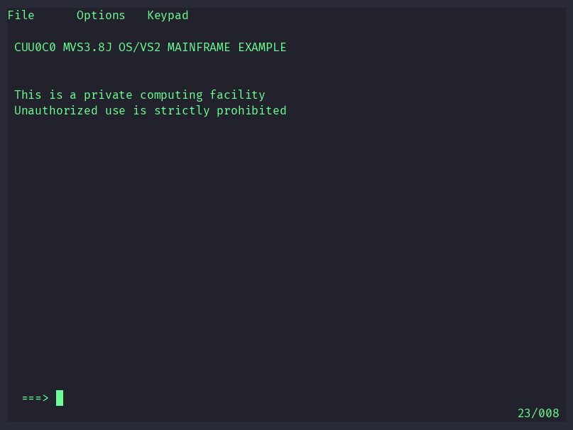

# mvs-copilot-ispf

An ISPF menu option (`P  COPILOT`) for MVS 3.8j / [TK5](https://github.com/mvslovers/mvs-tk5)
that lets you talk to GitHub Copilot from a 3270 terminal.

[

The recording ([`docs/demo.cast`](docs/demo.cast), play it with
`asciinema play docs/demo.cast`) shows a 3270 session: TSO logon, option `P`,
a question, the reply and PF8/PF7 paging.

```
 ------------------------ COPILOT TWO-WAY MESSAGING ---------------------------
 Command ===>
 Status  : Reply to request 00007
 Your message to Copilot:
 Name three z/OS data set types
 Copilot reply:
 THREE Z/OS DATA SET ORGANIZATION TYPES:
 1. SEQUENTIAL (PS) - RECORDS STORED IN PHYSICAL ORDER.
 ...
```

MVS 3.8j has no TCP/IP client, so the two sides meet in a mailbox of two
sequential data sets that the host reads and writes through
[mvsMF](https://github.com/mvslovers/mvsmf) (the z/OSMF-compatible REST API):

| Data set | Written by | Contents |
|---|---|---|
| `<userid>.COPILOT.REQUEST` | the ISPF panel | `ID=nnnnn USER= DATE= TIME=`, then up to 3 text lines |
| `<userid>.COPILOT.REPLY` | the host watcher (or any client) | `ID=nnnnn` echoing the request ID, then any number of text lines |

The panel shows "waiting" until the reply ID reaches the request ID. Long
replies are paged 12 lines at a time with PF8 (down) and PF7 (up).

## Requirements

- TK5 (or another MVS 3.8j) with **ISPF V2R2M0** installed and mvsMF/HTTPD running
  (TK5 `Packages/ISPFV2R2M0`; the vendor libraries are `ISP.V2R2M0.*`).
- Your TSO logon proc is TK5's `SYS1.CMDPROC(ISPLOGON)`, which puts
  `<userid>.ISP.PLIB` and `<userid>.CMDPROC` ahead of the vendor libraries.
- On the host: Python 3.8+ and, for automatic answers, the
  [GitHub Copilot CLI](https://docs.github.com/en/copilot/how-tos/set-up/install-copilot-cli)
  (`npm install -g @github/copilot`) already logged in.

## Install the dialog

```bash
git clone https://github.com/locusf/mvs-copilot-ispf.git
cd mvs-copilot-ispf
export ZOSMF_USER=HERC01 ZOSMF_PASSWORD=... ZOSMF_BASE_URL=http://127.0.0.1:8090
python3 install.py --dry-run     # optional: check what would happen
python3 install.py
```

This writes three members and touches nothing else:

- `<userid>.CMDPROC(COPILOT)` - the CLIST
- `<userid>.ISP.PLIB(COPILP1)` - the panel
- `<userid>.ISP.PLIB(ISP@PRIM)` - a copy of the vendor primary menu with the
  `P` line and its selection entry added (patched byte-exactly, so the
  attribute characters survive)

The `<userid>.CMDPROC` and `<userid>.ISP.PLIB` data sets are created (FB 80)
if missing. `--hlq` installs under another qualifier and `--vendor-plib`
names a different vendor panel library. Re-running is safe. The installation is per user,
because the vendor libraries are left alone; repeat it for each TSO user
that should see the option.

If the installer cannot find its anchors in `ISP@PRIM` (a customised menu),
add these two lines yourself: a menu line such as
`%   P +COPILOT     - Two-way messaging with GitHub Copilot` and, inside
the `&ZSEL = TRANS(...)` block, `P,'CMD(%COPILOT)'`.

Log on to TSO and choose `P` on the ISPF primary menu. The mailbox data sets
are created on first use.

## Run the responder

Without a responder nothing answers: the panel only writes the request.
`copilot_watcher.py` polls the request data set every 3 seconds, writes an
immediate acknowledgement, then asks the Copilot CLI (with **all tools
disabled**) for an answer and writes that as the reply.

```bash
ZOSMF_USER=HERC01 ZOSMF_PASSWORD=... python3 copilot_watcher.py            # answers
ZOSMF_USER=HERC01 ZOSMF_PASSWORD=... python3 copilot_watcher.py --ack-only # ack only
```

Environment: `ZOSMF_USER`, `ZOSMF_PASSWORD`, `ZOSMF_BASE_URL`
(default `http://127.0.0.1:8090`), `COPILOT_HLQ` (mailbox qualifier, default
the user). Run one watcher per mailbox owner.

### As a systemd user service

```bash
mkdir -p ~/.config/copilot-ispf ~/.config/systemd/user
install -m 600 systemd/env.example ~/.config/copilot-ispf/env   # then edit it
cp systemd/copilot-ispf-watcher.service ~/.config/systemd/user/
# edit WorkingDirectory/ExecStart if the repo is not in ~/mvs-copilot-ispf,
# and PATH so it contains python3 and the npm-installed `copilot`
systemctl --user daemon-reload
systemctl --user enable --now copilot-ispf-watcher
journalctl --user -u copilot-ispf-watcher -f
```

Use the npm-installed `copilot` on `PATH`, not the VS Code shim: the shim asks
to install the CLI when it has no terminal. `loginctl enable-linger $USER`
keeps the service running when you are logged out.

## Answering yourself

Any client that can write the reply data set works, for example an MCP
server for mvsMF or `curl`:

```bash
curl -u USER:PASS -H 'X-CSRF-ZOSMF-HEADER: x' \
     http://127.0.0.1:8090/zosmf/restfiles/ds/HERC01.COPILOT.REQUEST
printf 'ID=00007\nHello from the host.\n' | curl -u USER:PASS \
     -H 'X-CSRF-ZOSMF-HEADER: x' -H 'Content-Type: text/plain' -X PUT \
     --data-binary @- http://127.0.0.1:8090/zosmf/restfiles/ds/HERC01.COPILOT.REPLY
```

The `ID=` on the first reply record must be the request's ID, as five digits.

## Limitations

- Text is folded to **upper case** in both directions: the MVS 3.8j CLIST
  engine cannot preserve case.
- There is no push to the terminal; press ENTER on the panel to refresh.
- A message may not contain `&`, unbalanced quotes or parentheses (CLIST
  substitution). Up to three 72-character lines per message.
- The panel body must fit 24 rows. Do not add rows: a taller panel fails
  with a bare `DISPLAY` RC=20.

## Security notes

- Message text comes from a terminal user and is treated as untrusted: the
  Copilot CLI runs with `--available-tools=none`, so a message cannot make it
  touch files or the mainframe.
- The mvsMF password is only read from the environment or a mode 0600 file;
  nothing in this repository contains credentials.

## Uninstall

Delete the three members above; remove the `P` line and its `TRANS` entry
from `<userid>.ISP.PLIB(ISP@PRIM)` (or delete that member to fall back to the
vendor menu), and stop the service.

## License

MIT, see [LICENSE](LICENSE).
